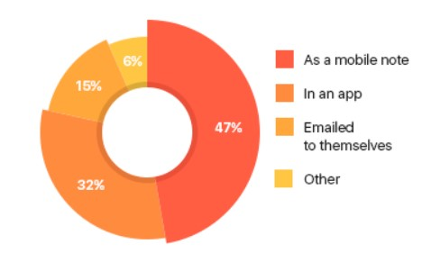

## Investigación Previa

### Uso de Listas

Con los avances en la tecnología moderna hasta la fecha, las listas de compra hechas en papel están quedando cada vez mas obsoletas. Para ilustrar esto, en Estados Unidos, a comienzos del año 2012, un estudio realizado por NinthDecimal Inc en el año 2014 reveló que el 90% de los estadounidenses realizaban sus listas de compra de alimentos en papel. En tan solo dos años, esa situación cambio radicalmente. Un 69% de los que hacen listas de compra pasaron a hacerlo a través de sus smartphones. De este porcentaje, 47% lo hacen mediante "mobile notes", el 32% utiliza una app, el 15% las redacta por mail y se las manda a ellos mismos, y el 6% recurre a otros métodos.

Al mismo tiempo, también respondieron en que momento recurren a estas notas.  

- Un 68% las usa para descubrir nuevos productos  

- Un 86% las utiliza para prepararse a hacer compras

- Un 59% recurre a ellas mientras esta comprando

Y los numeros siguen aumentando en la actualidad, segun Flurry, una de las mas plataformas más conocidas en "mobile analytics",el uso de aplicaciones de compras aumento un 77%.

### Uruguay

Uruguay no se queda atrás, hasta antes de la emergencia sanitaria ocurrida en marzo del 2020, la consultora Cifra elaboro para la Cámara de la Economía Digital del Uruguay(CEDU) un estudio en el que señala que un 52% compra o prepara sus compras a través de internet. Si analizamos la franja hectárea, hay una relación inversamente proporcional entre la edad de la población y la frecuencia de uso de estas plataformas. Apenas un 12% de personas mayores a 60 años contra un 44% de la población que tiene entre 18 y 29 años.

### Verdulerias y su demanda

Si ya un 52% de la población es un número significante para compras en internet, la tendencia aumento rotundamente ante la llegada del Covid-19. Es decir, en este año tan particular, los cambios en los hábitos de consumo fueron muchos, y entre esos el pedido al puesto de frutas y verduras no fue la excepción.  

Según un análisis hecho por PedidosYa, el número de pedidos a estos comercios procesados a través de la plataforma se multiplicaron, desde comienzo de año a la fecha, en prácticamente por 10, siendo el inicio de la emergencia sanitaria, hacia mediados de marzo de 2020, el pico más alto de los pedidos pero que, durante el resto de los meses, mantuvo su tendencia.Para la plataforma de delivery, la llegada de la pandemia hizo que los pedidos a este tipo de comercios tuvieran un crecimiento de casi 300% de un mes a otro. Incluso, la cantidad de comercios de este rubro registrados en PedidosYa también creció en el último año, duplicando la oferta.  

Consultamos una nota del diario El Observador donde justamente da evidencia de esto en el departamento de Montevideo, especialmente en el centro, donde se ha notado un incremento en la cantidad de puestos en los últimos meses.

### Comprando verduras y frutas

Los consumidores de verduras y frutas suelen ser muy sensibles cuando sus precios se disparan, por eso, saber administrar su gasto puede hacer la diferencia,Los consejos para comprar pueden resumirse en cuatro ítems.

#### **Identificar la estacion**

No es lo mismo una frutilla en noviembre que en abril. Y no solo porque sea más sabrosa o nutritiva en el primer caso, sino porque su precio varía sensiblemente. Es decir, en cada momento hay frutas y verduras que tienen precios más accesibles porque están en su estación. Por ejemplo, el verano es el momento óptimo para comprar tomates, el invierno para cítricos y vegetales de hoja, y la primavera para frutillas. Los precios oscilan en el año dentro de ciertos parámetros, pero pueden superar los límites de normalidad por problemas de oferta.

#### **Sustituir los caros**

Gracias a la abundancia de frutas y verduras en el mercado, es clave saber que verdura o fruta sustituye mejor a otro. Por ejemplo, en invierno se puede reemplazar la acelga por espinaca (y viceversa) y sí las mandarinas están muy caras, pueden sustituirse con peras o naranjas, que son más resistentes a las inclemencias del tiempo.

#### **Planificar la semana**

La compra por impulso es desaconsejada. El éxito para economizar en frutas y verduras está en la planificación semanal. Eso ayuda a tener un listado de ingredientes que realmente necesitás para cocinar. También es clave saber que cada fruta o verdura tiene vida hábil diferente, es decir, el tiempo hasta el que pueden permanecer conservadas.

#### **Minimizar desperdicios**

Saber conservar los vegetales permite reducir el desperdicio y aprovechar más cada peso gastado. Un error frecuente es poner todos en la heladera. No es cierto que a baja temperatura todos duran más. También hay partes de las verduras que el consumidor no suele aprovechar.

### **Lista inteligente del mercado modelo**

Cada 15 días sale una nueva "Lista inteligente", una lista proporcionada por el Ministerio de Ganadería, Agricultura y Pesca donde se presentan frutas y verduras de estación que se encuentran en óptimas condiciones de sabor, valor nutricional y precio. Los productos sugeridos en la Lista Inteligente son elegidos por tener una abundante oferta en el UAM, antes Mercado Modelo, además de buena calidad. A pesar de no estar disponible en formato de aplicación, estas listas se pueden encontrar en formato PDF en la pagina de UAM. Aunque parece más un resumen que una lista, este documento aporta y transmite información valiosa de forma sencilla a los consumidores al momento de administrar su gasto.

### **Conclusiones**  

- Por todos los avances tecnológicos hasta la fecha, ya existe una tendencia de dejar de lado el papel para hacer listas de compras. No sólo en Uruguay, donde aproximadamente un 52% de la población utiliza su telefono o la web para realizar compras, sino en todo el resto del mundo.

- Hay una relación inversamente proporcional entre la edad de la población y la frecuencia de compras en línea, sin embargo, gracias a la emergencia sanitaria del covid19, muchas actvidades requirieron de un formato virtual, entre ellas la compra y venta de verduras y frutas. Ante esa situación, y lo detallado anteriormente sobre un considerable aumento en la demanda en verdulerías durante la pandemia, inducimos que varias personas sin experiencia (posiblemente mayores) lograron adaptarse al formato de crear una lista virtual.
- A la hora de comprar verduras y frutas, hay algunos factores a tener en cuenta si se le quiere el maximo provecho:

    1. Identificar las diferentes estaciones para comprar verduras y frutas.
    2. Tener claro cual es el sustituyente de cada fruta/verdura.
    3. No comprar por impulso, planificar con antelación que hay que comprar para la semana. También tener en cuenta cuanto tiempo se pueden conservar las verduras o frutas a comprar.
    4. Saber conservar bien los vegetales y frutas compradas para aprovecharlas en su totalidad.

- La Lista inteligente, brindada por el Ministerio de Ganadería, Agricultura y Pesca cada 15 dias, es una lista donde se describen las verduras y frutas mas populares de la temporada del momento. Por la información que aporta en nutrientes, precio y consejos de compra sobre las verduras y frutas del mercado, puede resultar de vital importancia para los consumidores.
