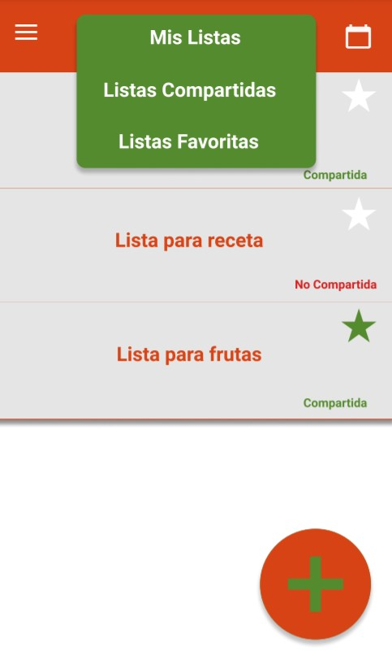
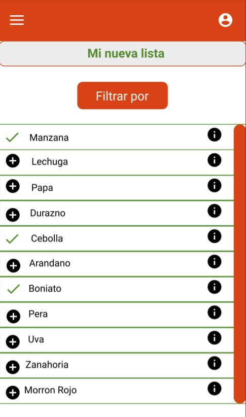
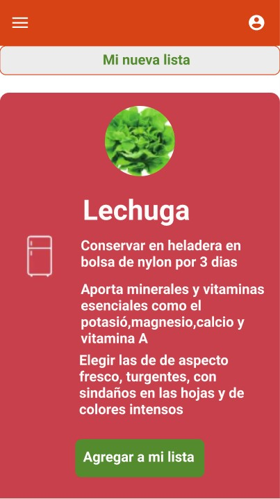
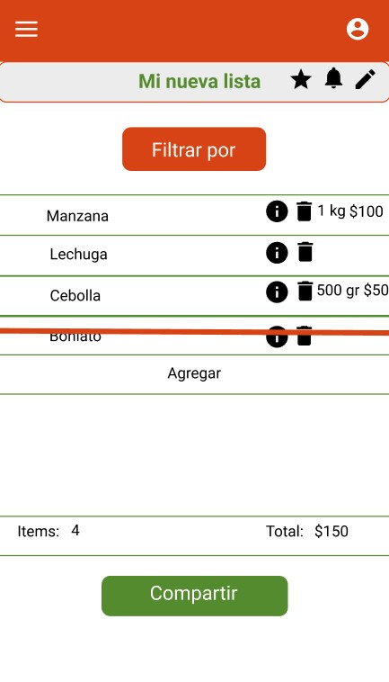
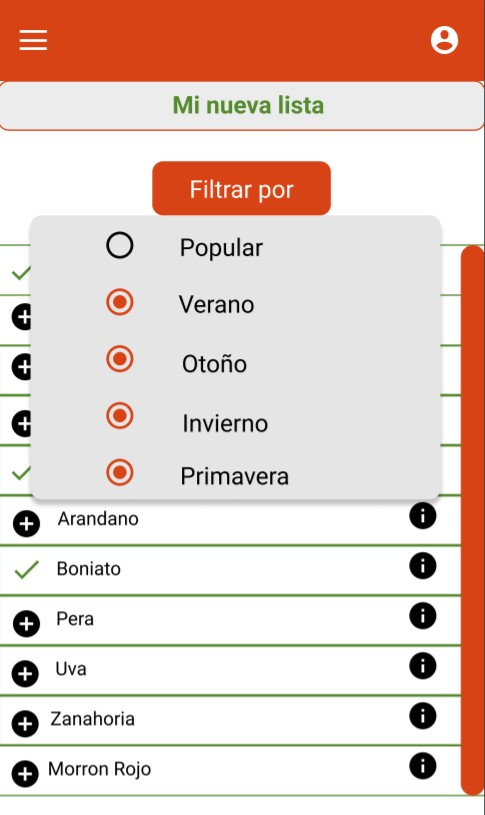
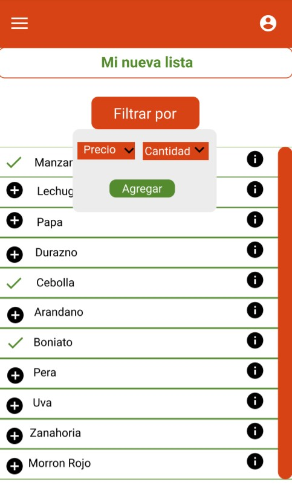

# **Proyecto de Ingeniería de Requerimientos - Aplicacion Verdulería**

# Elicitación

La elicitación, específicamente de requerimientos de ingeniería de software, se basa en identificar las características del software de los interesados y las limitaciones de éste.

Las técnicas de elicitación más comunes para la extracción de contenido son la obtención del perfil del interesado, una entrevista, trabajos en grupo, cuestionarios y la ingeniería inversa.

Para enfrentar el problema, aplicamos las técnicas de tormenta de ideas, entrevista e ingeniería inversa. A su vez, una vez identificados nuestros tipos de usuarios, utilizamos la técnica de user personas para modelarlos.

### ENTREVISTA

A los efectos de abordar el tema objeto de este trabajo, nos contactamos con Francisco Rodriguez, gerente de Feria Vegetal, para conocer de primera mano cuales son los comportamientos, requerimientos y principales "drivers" que motivan la compra de frutas y verduras.

De la entrevista que mantuvimos con el gerente de Feria Vegetal, arribamos a las siguientes conclusiones:

### Conclusiones de la Entrevista

- El consumidor uruguayo, en especial a partir de los adultos mayores, es muy tradicionalista, sabe de lo que está hablando. Al momento de comprar, suele tener claro cuales son las frutas y verduras más importantes de cada temporada.
- La mayoría de los consumidores son adultos mayores y suelen obviar los pedidos por web, compran en el local o piden por telefono.
- Cada día se ve más personas jovenes comprando en puestos de verduras y frutas.
- Exceptuando a los vecinos que vuelven a comprar casi todos los días, los consumidores vuelven a comprar una o dos veces por semana.

### INGENIERÍA INVERSA: retroingeniería

### Aplicaciones

Buscamos y descargamos las aplicaciones más conocidas para hacer listas de compras. Pocas de ellas eran solo para listar frutas y verduras, algunas se extendían a cualquier tipo de alimentos, pero todas compartían la filosofía de ser plataformas para crear listas de alimentos para las familias.

De allí, tomamos nota de todos los atributos de las mismas que llamaron nuestra atención y que consideramos potencialmente útiles para nuestro proyecto.

A su vez, a partir de las reseñas disponibles en la web, Google Play (Android) y App Store (iOS), extraímos las necesidades que los usuarios consideraron más positivas en las aplicaciones y aprendimos de ciertas funcionalidades que les disgustaron.

### Lista Inteligente

Para complementar con las aplicaciones de lista de compras de alimentos, también decidimos investigar a fondo las Listas Inteligentes del Ministerio de Ganadería, Agricultura y Pesca con el fín de observar sus puntos fuertes y débiles y, por que no, extraer posibles requerimientos para el proyecto.

### Conclusiones de Ingeniería Inversa

### Aplicaciones

Nos centramos principalmente en tres de las aplicaciones mas descargadas para hacer listas de compras en el mercado de Android e iOS: "Listonic","Bring" y "That Shopping List"

- La mayoría de los usuarios destacan una simple interfaz de usuario y un fácil aprendizaje de las herramientas del sistema.

- La mayoría de los usuarios valoran que las operaciones de agregar, quitar y modificar elementos de una lista sean intuitivas y rápidas de hacer.

- La mayoría de los usuarios valoran la opción de poder ordenar los elementos de sus listas por categorías, ya sean categorías que vienen por defecto o personalizadas.

- La mayoría de los usuarios aprecian la funcionalidad de compartir listas con otros usuarios, y que estos puedan participar y hacer cambios en las mismas.

- Algunos usuarios están desconformes con lo invasivas que pueden ser las publicidades en la interfaz a la hora de crear/modificar una lista.

- Algunos usuarios destacan contar con un historial de elementos ya agregados a listas anteriores para reutilizarlos en nuevas listas.

- Algunos usuarios destacan la facilidad de marcar y desmarcar a los elementos como comprados.

- Algunos usuarios valoran poder agregar información adicional a los elementos que agregan a sus listas, como precio, cantidad y posibles descuentos.

- Algunos usuarios reclaman poder asignar atributos por defecto a elementos (como precio y cantidad) para no tener que modificarlos manualmente cada vez que son agregados a listas diferentes.

### Lista Inteligente

- Las listas inteligentes aportan información que puede ser muy valorada tanto por consumidores conocedores del mercado de verduras y frutas como por consumidores que no conocen tanto el mercado. Aunque el documento está presentado de manera bastante intuitiva y fácil de leer para el lector, tener que recurrir especialmente a un documento PDF para consultar esta información puede tener un resultado contraproducente. Por eso creemos que presentando la misma información de conservación, valor nutricional y consejos de compra que aporta el documento en un formato de aplicación móvil, se le puede sacar mucho mas provecho.

### TORMENTA DE IDEAS: discusiones y sugerencias

- Mostrar por fruta y verdura los nutrientes y beneficios que brinda la misma.

- Que se pueda crear un usuario para tener las listas sincronizadas en varios dispositivos.

- Que se pueda administrar las listas realizadas por todos los miembros de la familia.

- La inclusión de un recordatorio para comprar frutas y verduras cada determinado tiempo.

- Un calendario para poder planificar y hacer listas para los distintos días de la semana.

- Tener acceso a listas ya usadas ("guardar en favoritos")

- Que haya sugerencias para agregar frutas y verduras a las listas y que aparezcan con prioridad en función de la temporada en la que se esté, brindando información sobre la prioridades y la cantidad demandada de las mismas.

### User Personas

Los roles que identificamos como usuarios de la aplicación son los siguientes:

- Hijo joven
- Padre/Madre
- Amo de casa

Una posible ama de casa podría ser la siguiente:

Por otro lado un hijo de familia podría estar figurado de la siguiente manera:

## Evidencia de actividades de investigación
  
### **Información**

Uso de Listas [1]

Uruguay [2]

Verdulerías y su demanda [3]

Comprando verduras y frutas [4]

### **Reseñas de las siguientes aplicaciones (Ingeniería Inversa)**

Listonic Grocery Shopping List [5]

That Shopping List [6]

Bring! Shopping List & Recipes [7]

Lista Inteligente [8]

### **Caracterización de usuarios: User Personas**

Template [9]

### **BocetosIU**

Aplicación [10]

### Buenas prácticas de versionado

Conventional Commits[11]

## Modelo conceptual del problema

A través del análisis del concepto del problema se identificaron las siguientes clases con sus funcionalidades respectivas

- Usuario

- Perfil de usuario

- Lista

- Fruta

- Verdura

- Calendario

- Recordatorio

- Sistema: contiene funcionalidades sobre los perfiles de usuarios, frutas, verduras, listas, calendarios, recordatorios y métodos asociados.

La siguiente imágen muestra el modelo Entidad-Relación del problema a resolver:

# Especificación

### ACTORES

- Sistema
- Usuario

## User Stories

## ID: #1

### Título: Filtrado de productos

COMO amo de casa quiero ver diferentes informaciones útiles de verduras y frutas indicando sugerencias de compra para mi lista.

### Criterios de aceptación

- Debe tener sugerencias que aporten valor nutricional de las verduras y frutas al usuario.
- Debe haber una sección orientada a las frutas y verduras recomendadas por temporada.

## ID: #2

### Título: Registro de Usuario

COMO padre/madre de familia quiero registrarme en la aplicación para utilizar mis listas de compra desde otro dispositivo.

### Criterios de aceptación

- Como usuario de la aplicación debo de tener acceso y modificación sobre las listas guardadas en mi perfil de usuario.

## ID: #3

### Título: Planificar una lista de compras

COMO amo de casa quiero guardar una lista de compras para cierta fecha con el fín de recordar los productos a comprar

### Criterios de aceptación

- Debe de tener una sección con fechas donde se pueda anotar las frutas y verduras a comprar un día en específico, avisándole posteriormente al usuario de alguna manera.

## ID: #4

### Título: Compartir una lista

COMO Hijo joven quiero compartir una de mis listas para que otros usuarios puedan modificar y agregar elementos a la misma.

### Criterios de aceptación

- Los usuarios con la que fue compartida la lista deben tener acceso y modificación sobre la misma.

## Definición de requerimientos funcionales y no funcionales

### RF1: Crear lista

Actor: Usuario

Descripción: El sistema deberá contar con la funcionalidad vital de crear una lista de compras no vacía para poder listar tus productos para la compra. Tiene la opción de añadir un recordatorio para una fecha determinada.

Prioridad: Alta

### RF2: Eliminar lista

Actor: Usuario

Descripción: El sistema deberá contar con la funcionalidad de eliminación de una lista específica de compras del sistema.

Prioridad: Alta

### RF3: Modificar lista

Actor: Usuario

Descripción: El sistema deberá contar con la funcionalidad de habilitación de modificación de una lista de compras.

Prioridad: Alta

### RF4: Guardar lista

Actor: Usuario

Descripción: El sistema deberá contar con la funcionalidad de guardar de forma segura la lista seleccionada de compras como favoritos y en el sistema.

Prioridad: Alta

### RF5: Filtrar productos

Actor: Sistema

Descripción: El sistema deberá contar con la funcionalidad de exposición de frutas y verduras (mutuamente excluyentes) por temporada (estación del año) y por popularidad.

Prioridad: Alta

### RF6: Crear perfil de usuario

Actor: Usuario

Descripción: El sistema deberá contar con la funcionalidad de la creación de un usuario.

Prioridad: Alta

### RF7: Eliminar perfil de usuario

Actor: Usuario

Descripción: El sistema deberá contar con la funcionalidad de eliminación del usuario seleccionado con sus datos asociados del sistema.

Prioridad: Alta

### RF8: Acceso al calendario

Actor: Sistema

Descripción: El sistema deberá contar con la funcionalidad de uso de un calendario para anotar las listas de compra.

Prioridad: Media

### RF9: Marcar producto como comprado

Actor: Usuario

Descripción: El sistema deberá contar con la funcionalidad de marcar un producto de una lista para seleccionarlo como comprado.

Prioridad: Media

### RF10: Compartir lista

Actor: Usuario

Descripción: El sistema deberá contar con la funcionalidad de compartir una lista con otros usuarios ya registrados en el sistema.

Prioridad: Alta

### RF11: Visualización de información sobre verduras y frutas

Actor: Usuario

Descripción: El sistema deberá contar con la funcionalidad de mostrar información nutricional, consejos de conservación y de compra que aporta cada elemento de la colección de verduras o frutas del sistema.

Prioridad: Alta

### RNF1: Entorno de desarollo

Descripción: El sistema deberá ser programado en JavaScript: Node.JS v14.16.0

Prioridad: Alta

### RNF2: Idioma

Descripción: El sistema deberá ser desarrollado para usuarios con habla hispana.

Prioridad: Alta

### RNF3: Eficiencia

Descripción: El sistema deberá de tener tiempos de respuesta en todas las funcionalidades de un máximo de 7 segundos.

Prioridad: Alta

### RFN4: Portabilidad

Descripción: El sistema deberá de tener compatibilidad con dispositivos con Android 8.1 en adelante

Prioridad: Alta

### RFN5: Tipografía

Descripción: La fuente de texto utilizada por el sistema debe ser "Roboto"

Prioridad: Alta

### RFN6: Especificación de colores en el diseño

Descripción: El sistema deberá ser diseñado con un color primario "Light Green 800" y un color secundario "Deep Orange 800".

Prioridad: Alta

## Use Cases detallados

## Caso de Uso 1:

### **Título**: Crear una nueva lista

Actor: Usuario

Precondiciones: el usuario debe estar registrado en el sistema.

Postcondiciones: la lista debe figurar como guardada en el sistema.

Requerimientos que cubre: RF1, RF2, RF4, RF5 Y RF8

### Curso Normal

|Acciones de los actores|Respuesta del sistema|
|-----------------------|---------------------|
|1. El usuario elige una fecha para crear una nueva lista y accede a la opción de crearla| 2. El sistema le pide al usuario que ingrese el nombre de la nueva lista|
|3. El usuario ingresa el nombre de la lista| 4.El sistema carga todas las colecciones de frutas y verduras (las cuáles pueden ser filtradas por temporada o por popularidad) que pueden ser agregadas a la lista|
|5. El usuario agrega a la lista por lo menos una fruta o verdura (indicando el precio y cantidad si lo desea)| 6. Se guarda la lista en el sistema.

### Cursos alternativos

3.1: El usuario ingresa un nombre no válido (nombre vacío)  
3.2: El Sistema le solicita al usuario que ingrese un nombre válido (nombre no vacío)  
5.1: El usuario no agrega ninguna fruta ni verdura a la lista.  
5.2. La lista no se guarda en el sistema y se procede a eliminarla.

## Caso de Uso 2:

### **Título**: Consultar información de una verdura o fruta de una lista

Actor: Usuario

Precondiciones: el usuario está registrado en el sistema y tiene acceso a al menos una lista

Postcondiciones: ---

Requerimientos que cubre: RF11

### Curso Normal

|Acciones de los actores|Respuesta del sistema|
|-----------------------|---------------------|
|1. El usuario accede a una de sus listas | 2. El sistema carga todas las frutas y verduras que ya fueron agregadas a la lista|
|3. El usuario accede a la sección de información de una verdura o fruta de la lista| 4. El sistema carga la información nutricional, de conservación y consejos de compra para la verdura o fruta seleccionada|

## Caso de Uso 3:

### **Título**: Compartir una lista con otro usuario

Actor: Usuario

Precondiciones: Ambos usuarios deben estar registrados en el sistema, el usuario que comparte debe tener acceso a al menos una lista.

Postcondiciones: Ambos usuarios tienen acceso a la lista compartida.

Requerimientos que cubre: RF10

### Curso Normal

|Acciones de los actores|Respuesta del sistema|
|-----------------------|---------------------|
|1. El usuario accede a una de sus listas | 2. El sistema carga todas las frutas y verduras que ya fueron agregadas a la lista|
|3. El usuario accede a la opción de compartir lista|4. El sistema carga a todos los usuarios con la que la lista ya fue compartida|
|5. El usuario solicita compatir la lista con un nuevo usuario| 6. El sistema le solicita al usuario que ingrese el nombre del usuario con el que quiere compartir la lista|
|7. El usuario ingresa el nombre de usuario correspondiente | 8.El sistema ofrece acceso de modificación de la lista a dicho usuario|

### Curso Alternativos

7.1: El usuario ingresa un nombre de usuario inválido (no existente en el sistema o vacío)  
7.2: El sistema le solicita al usuario que vuelva a ingresar el nombre de usuario

## Caso de Uso 4:

### **Título**: Editar una lista

Actor: Usuario

Precondiciones: el usuario tiene acceso a por lo menos una lista

Postcondiciones: la cambios en la lista fueron guardados en el sistema

Requerimientos que cubre: RF3 y RF9

|Acciones de los actores|Respuesta del sistema|
|-----------------------|---------------------|
|1. El usuario accede a una de sus listas.| 2. El sistema carga todas las frutas y verduras que ya fueron agregadas a la lista.|
|3. El usuario modifica la lista, ya sea agregando/quitando verduras y frutas, cambiando su precio o cantidad, o marcandolas como compradas| 4. Los cambios son guardados en el sistema.|

### Cursos alternativos

3.1 El usuario no hace modificaciones en la lista.  
3.2 El sistema no hace nada.

## Caso de Uso 5:

### **Título**: Guardar una lista como favorita

Actor: Usuario

Precondiciones: el usuario tiene acceso a por lo menos una lista

Postcondiciones: el sistema guardó a la lista en la sección de favoritos

Requerimientos que cubre: RF4

|Acciones de los actores|Respuesta del sistema|
|-----------------------|---------------------|
|1. El usuario accede a una de sus listas| 2. El sistema carga todas las frutas y verduras que ya fueron agregadas a la lista|
|3. El usuario utiliza la opción de agregar una lista a favoritos y agrega a esta lista| 4. El sistema guarda la lista en la sección de favoritos y le notifica al usuario que el proceso fue realizado con éxito

### Cursos Alternativos:

3.1 La lista que el usuario está intentando colocar en la sección de favoritos ya estaba agregada.

3.2 El sistema quita la lista de la sección de favoritos.

## Caso de Uso 6:

### **Título**: Crear un perfil de usuario

Actor: Usuario

Precondiciones: ---

Postcondiciones: El perfil del usuario fue registrado en el sistema

Requerimientos que cubre: RF6

|Acciones de los actores|Respuesta del sistema|
|-----------------------|---------------------|
|1. El usuario accede a la opción de crear un nuevo usuario| 2. El sistema le solicita al usuario que llene los siguientes campos: "nombre de usuario","email", "contraseña" y "confirmar contraseña"|
|3. El usuario llena todos los campos de forma correcta (no hay ningun campo vacío, los campos: "email" y "nombre de usuario" no estan registrados en el sistema y los campos "contraseña" y "confirmar contraseña" coinciden completamente)| 4. El sistema guarda el perfil de usuario en el sistema y le notifica al usuario que el proceso fue relizado correctamente|

### Cursos alternativos:

3.1 El usuario completa por lo menos un campo de manera incorrecta (que no se cumpla alguna de las condiciones puestas en el punto 3)  
3.2 El sistema le solicita al usuario que vuelva a llenar los campos que estaban incorrectos.

## Caso de uso 7:

### **Título**: Agregar un recordatorio sobre una lista

Actor: Usuario

Precondiciones: el usuario tiene acceso a por lo menos una lista

Postcondiciones: el recordatorio fue guardado en el sistema correctamente

Requerimientos que cubre: RF1

|Acciones de los actores|Respuesta del sistema|
|-----------------------|---------------------|
|1. El usuario accede a una de sus listas|2. El sistema carga todas las frutas y verduras que ya fueron agregadas a la lista|
|3. El usuario accede a la opción de agregar recordatorio|4. El sistema le solicita al usuario que ingrese la fecha y hora en la que quiere ser notificado|
|5. El usuario selecciona una fecha y una hora determinada| 6. El recordatorio es guardado en el sistema y se le notifica al usuario que recibirá una notificación en ese entonces.|

### Cursos Alternativos

5.1 El usuario no selecciona ninguna fecha ni hora.  
5.2 El sistema le solicita al usuario que eliga una fecha y hora para crear el recordatorio.

## Bocetos de IU

Realizamos un boceto en la plataforma Figma con el fín de ilustrar como seria una posible interfaz de usuario del sistema. Para ello, tuvimos en cuenta los requerimientos definidos, los casos de usos, y los estandares propuestos para la implementación.  
Estandares:

- Colores: Light Green 800 y Deep Orange 800
- Fuente: Roboto
- Iconos: filled

### Menu principal

Esta pantalla principal, sería el entorno en el cual el usuario tiene fácil acceso a sus listas (propias, compartidas y favoritas) y a un calendario para gestionar las mismas. Además de la opción de crear una nueva lista. Las estrellas permiten agregar una lista a la sección de favoritos de manera sencilla.

### Crear una nueva lista

En esta pantalla, el usuario agregaría verduras y frutas a su nueva lista. Para cada verdura o fruta que aparece allí, se puede consultar información y el usuario podra filtrarlas por diferentes categorias.

### Filtrando por categorías

El usuario puede seleccionar como quiere filtrar las frutas y verduras. Puede ser por estación (verano,otoño,invierno y primavera) o las consideradas más populares. Si no se marca ninguna opción el sistema muestra todas.

### Consulta de información verdura\fruta

Presionando el ícono de información sobre una verdura o fruta, el sistema despliega una pantalla con información sobre la misma. Se indica información de conservación, nutrientes y beneficios que aporta como tambien sugerencias a la hora de seleccionarlas en una verdulería. Si el usuario lo desea puede agregar la verdura o fruta a su lista.

### Agregar verdura o fruta a una lista

Luego de presionar para agregar la verdura\fruta a la lista, se despliega un cartel para que el usuario indique, si lo desea, el precio y cantidad de la misma.

### Ver, editar, compartir y agregar recordatorio a una lista finalizada

Una vez finalizada una lista, el usuario visualiza las verduras y frutas que ya fueron agregadas, y en caso de que haya sido indicado por el usuario, se muestra el precio y la cantidad. El usuario puede editar el contenido de la lista presionando "agregar" en la parte inferior o eliminando una verdura/fruta con el ícono correspondiente. También tiene la posibilidad de marcar las verduras y frutas como compradas, esto se representa simulando un "tachado" de una lista de papel. En la parte superior de la pantalla, esta la opción para editar el nombre de la lista, agregar un recordatorio sobre la misma y la opción de agregarla a la sección de listas favoritas. En la parte inferior, un cuadro indica la cantidad de items y precio total de la lista. Ademas está presente la opción de compartir la lista con otros usuarios.

# Validación y Verificación

## Validar la especificación

Se va a validar la especificación con un feedback de posibles usuarios y sus sugerencias sobre el prototipo. También se va a consultar de forma general con personas no involucradas en el proyecto.

### Validación con posibles usuarios

Contactamos a Yanina Gonzalez, una ama de casa y madre de familia, amiga de la madre de uno de los integrantes del grupo.
Yanina es una potencial usuaria ya que caracteriza efectivamente más de un rol, nos enriqueció mediante un feedback con observaciones después de haberle explicado resumidamente lo que sería el modelo del prototipo de la aplicación y la especificación de la misma.

Sus aportes y observaciones fueron los siguientes:
  
- Está completamente de acuerdo que la aplicación incluya su parte informativa y que no sea solamente una simple aplicación para listar productos para una verdulería. Efectivamente no le aportaría ningún valor si éste fuera el caso, y utilizaría las notas de su celular por costumbre, suplantando la descarga de app.

- Además nos comentó que sería interesante que la aplicación tenga su sector de propuestas de ideas acerca de recetas de jugos y tartas de frutas o verduras pero que claramente no es esencial para la misma.

- Recalcó que es importante, incluso vital, que el conjunto de las frutas y las verduras además de estar separadas entre sí, que para la visualización inmediata el orden alfabético es un gran punto a favor. Complementariamente, sugirió que haya un buscador que las pueda filtrar por el nombre o sinónimos de las mismas.

- Por último observó positivamente que se exprese la correcta unidad de medida en el listado ya que por ejemplo la manzana se mide en kilos, pero la palta es por simple numeración. Y en este último aspecto, claramente el uso de un contador.

### Validación con personas no involucradas

Contactamos a Victor Javier Garcia que, junto a su esposa Alicia de los Santos, aportaron sugerencias y realizaron observaciones sobre el avance de nuestro proyecto. Victor es dueño de El pesto, una verdulería ubicada en Pando, y junto a Alicia se encargan de todas las tareas administrativas del lugar. Alicia, ademas de realizar dichas tareas, también es madre y ama de casa, por lo tanto también carecteriza uno de los roles definidos en nuestro proyecto y hace aún mas valioso el aporte. La razón por la que nos comunicamos con Victor es por su cercanía al mundo de las verduras y frutas, y como dueño de un puesto, esta al tanto de las necesidades y requerimientos de sus compradores a la hora de comprar estos productos.

Luego de hacerle un resumen de las principales especificaciones del proyecto y mostrarle los bocetos de interfaz de usuario, sus aportes y observaciones fueron los siguientes:

- Destacó la presentación de la app en general, valora que sus funcionalidades sean sencillas y amigables de utilizar, sobre todo para un usuario que no tienen mucha experiencia utilizando apps de listas en smartphones.

- La función de mostrar información nutricional, de conservación y consejos de compras por verdura\fruta le pareció excelente. De hecho remarcó que es información por la cual los compradores de su puesto se interesan mucho y suelen preguntar seguido antes de comprar.

- Valora la forma en la que se despliegan las verduras y frutas cuando se elige cuales agregar a una lista. Sin embargo, le parece una buena idea que se puedan ordenar por orden alfabético. Y quizas, sea más practico separar los items por una categoría de frutas y otra de verduras. Incluso nos dijo que podriamos agregar otra categoría para aromaticos, pero en su opinión no es algo vital para la aplicación.

- Nos sugirió también que podriamos separar las verduras y frutas en subcategorías. Por ejemplo, en la categoría de frutas que haya una subcategoría para las frutas exóticas. De todas formas, lo que él considera vital es que se puedan filtrar por estación puesto que es lo que más le interesa a los consumidores.

- Sugirió que además de la presencia de los casilleros para agregar precio y cantidad, se incluya un casillero de observaciones. Ahí los usuarios podrían anotar el comercio donde van a comprar o alguna característica que notaron sobre alguna verdura y fruta que quieren tener anotado.

- Le pareció muy original y útil la funcionalidades de contar con un calendario para planificar listas y la opción de poner recordatorios sobre ellas. También apoya la utilidad de poder compartir listas con otros usuarios.

## Verificar la especificación

La verificación de la especificación se va a lograr mediante un checklist donde se va a comprobar cada uno de los requerimientos funcionales y los casos de uso.

Los verificación de los requerimientos va a estar basada en los aspectos fundamentales de las siguientes propiedades:

- completitud

- verificabilidad y no ambiguedad

- correctitud y consistencia

- trazabilidad

|Requerimiento|RF1|RF2|RF3|RF4|RF5|RF6|RF7|RF8|RF9|RF10|RF11
|-------------|--|--|--|--|--|--|--|--|--|---|--|
|¿Está correctamente prorizado?|Sí|Sí|Sí|Sí|Sí|Sí|Sí|Sí|Sí|Sí|Sí|
|¿Tiene una única interpretación?|Sí|Sí|Sí|Sí|Sí|Sí|Sí|Sí|Sí|Sí|Sí|
|¿Es consistente?|Sí|Sí|Sí|Sí|Sí|Sí|Sí|Sí|Sí|Sí|Sí|
|¿Esta identificado correctamente?|Sí|Sí|Sí|Sí|Sí|Sí|Sí|Sí|Sí|Sí|Sí|
|¿Permite realizar actividades de diseño o implementación?|Sí|Sí|Sí|Sí|Sí|Sí|Sí|Sí|Sí|Sí|Sí|
|¿Es viable?|Sí|Sí|Sí|Sí|Sí|Sí|Sí|Sí|Sí|Sí|Sí|

Los casos de uso se van a verificar de la siguiente manera:

|Caso de Uso|CU1|CU2|CU3|CU4|CU5|CU6|CU7|
|-----------|---|---|---|---|---|---|---|
|¿Tiene un objetivo único y medible?|Sí|Sí|Sí|Sí|Sí|Sí|Sí
|¿Se documentan los cursos alternativos?|Sí|Sí|Sí|Sí|Sí|Sí|Sí
|¿Están claros los actores que participan?|Sí|Sí|Sí|Sí|Sí|Sí|Sí
|¿Existen pre y post condiciones?|Sí|Sí|Sí|Sí|Sí|Sí|Sí
|¿Está libre de diseño e implementación?|Sí|Sí|Sí|Sí|Sí|Sí|Sí|
  
También hicimos otro checklist para verificar que todos los requerimientos previamente definidos estaban cubiertos por los casos de uso:

|Casos de uso|Requerimientos que cubren|
|------------|-------------------------|
|CU1|RF1,RF2,RF4,RF5,RF8|
|CU2|RF11|
|CU3|RF10|
|CU4|RF3,RF9|
|CU5|RF4|
|CU6|RF6|
|CU7|RF1|

# Referencias

[1] <https://www.ninthdecimal.com/wp-content/uploads/2015/01/ND_Insights_CPG_2014.pdf>

[2] <https://negocios.elpais.com.uy/noticias/mitad-uruguayos-compra-internet-sepa-consumen.html>

[3.1] <https://www.elobservador.com.uy/nota/las-verdulerias-y-fruterias-se-ponen-de-moda-en-uruguay-que-lo-explica--20213225038>

[3.2]-[4.1] <https://infonegocios.biz/enfoque/la-verduleria-mas-grande-de-uruguay-tiene-nombre-y-apellido-y-los-pedidos-de-frutas-y-verduras-se-triplicaron>

[4.2] <https://negocios.elpais.com.uy/finanzas/optimizar-gasto-verduleria.html>

<http://www.mercadomodelo.net/canasta-inteligente>

[5]

<https://listonic.com/>

App Store <https://apps.apple.com/uy/app/listonic-grocery-shopping-list/id331302745>

Google Play <https://play.google.com/store/apps/details?id=com.l&hl=en&gl=US>

[6]

App Store <https://apps.apple.com/uy/app/that-shopping-list/id1082845559>

Google Play <https://play.google.com/store/apps/details?id=ch.publisheria.bring&hl=en&gl=US>

[7]

<https://www.getbring.com/>

App Store <https://apps.apple.com/uy/app/bring-shopping-list-recipes/id580669177>

Google Play <https://play.google.com/store/apps/details?id=de.markusliebschner.thatlist&hl=en&gl=US>

[8] <http://www.mercadomodelo.net/canasta-inteligente>

[9] <https://app.xtensio.com>

[10] <https://www.figma.com>

[11] <https://www.conventionalcommits.org/en/v1.0.0/>

## Glosario

### Repositorio Git

**Clonar repositorio:** Se refiere a utilizar el comando "git clone" en la terminal.

### Versionado

**Rama:** Es un espacio virtual de trabajo, un puntero movible a cierto commit.

**Mergear:** Se refiere a utilizar el comando de "git merge" en la terminal

**Árbol limpio de trabajo:** Se refiere a que todos los archivos que se agregaron a la staging area fueron commiteados.

**Versión estable:** Es una versión del trabajo consistente y actualizada que en una primera instancia no tiene errores. No tiene ninguna sección incompleta.

**Rama General:** Es la rama principal del proyecto, en nuestro caso la main.

### Especificación

**Recordatorio:** Se refiere a un aviso sobre la lista que le llega al usuario en un momento determinado. Puede ser una notificación, mensaje,etc.

**Tachado:** Es una simulación de la acción de tachar en las listas de papel, en donde los elementos se marcan como comprados una vez que son rayados por encima.